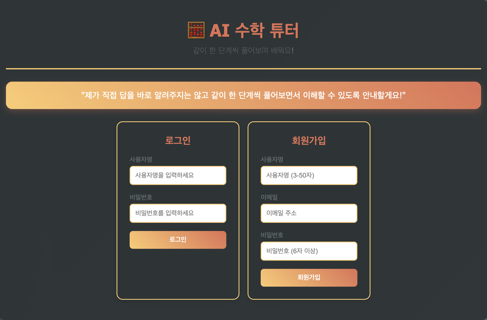
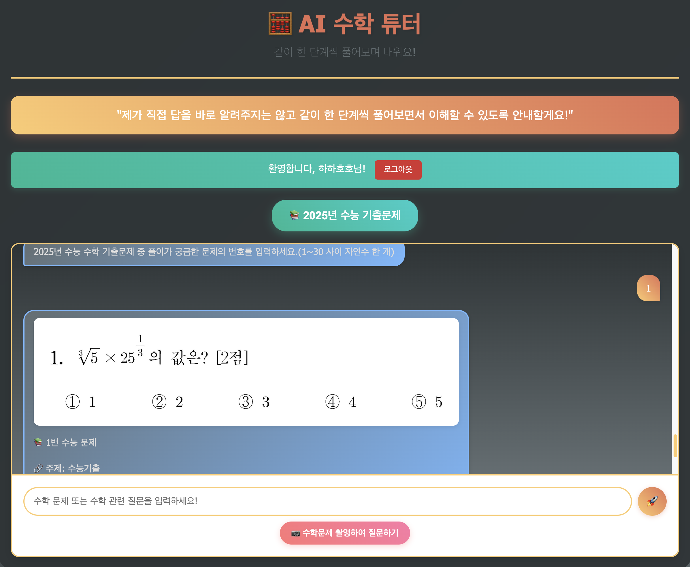
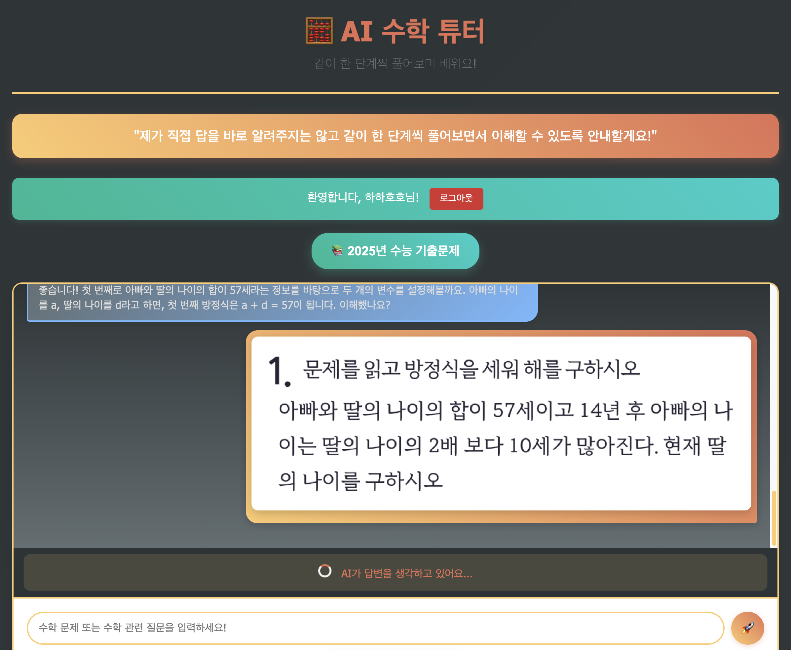
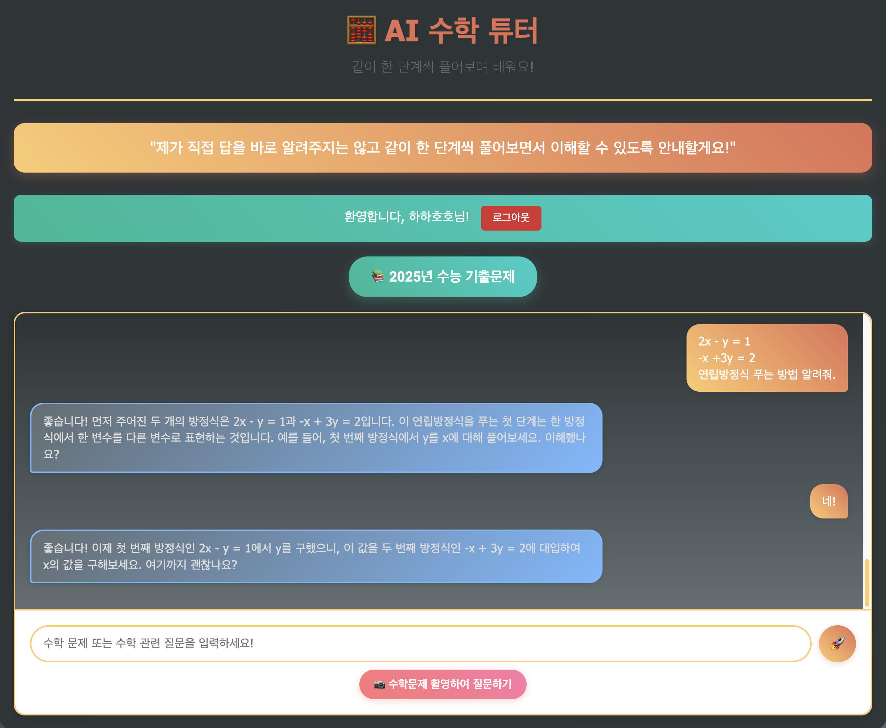

# AI 수학 튜터 (feat. ChatGPT API)

> "제가 직접 답을 바로 알려주지는 않고 같이 한 단계씩 풀어보면서 이해할 수 있도록 안내할게요!"

ChatGPT API를 활용한 대화형 수학 학습 플랫폼입니다. AI가 수학 문제를 단계별로 풀이하며 학습자의 이해도를 확인하면서 진행합니다. GitHub Pages 등을 통한 웹 배포를 염두에 두고 개발했습니다.

## ✨ 주요 기능

- **단계별 수학 튜터링**: AI가 1-2문장씩 설명하고 이해도 확인 후 다음 단계 진행
- **2025년 수능 기출문제**: 1-30번 문제 데이터베이스 조회
- **이미지 문제 인식**: EasyOCR을 통한 수학 문제 이미지 업로드 및 텍스트 추출
- **사용자 인증**: 회원가입/로그인 및 개별 대화 기록 저장
- **대화 기록 관리**: 채팅 세션별 기록 저장 및 복원

## 🛠️ 기술 스택

**Backend**
- FastAPI + SQLite + SQLAlchemy
- JWT 인증, bcrypt 암호화
- EasyOCR (이미지 처리)

**Frontend**
- HTML5 + CSS3 + JavaScript

## 📱 와이어프레임

### 로그인/회원가입 화면


### 수능 기출문제 질문하기


### 수학문제 촬영하여 질문하기


### 대화형 수학 학습



## 🚀 설치 및 실행

```bash
# 저장소 클론
git clone https://github.com/Henrychoiai/chatgpt-math-tutor.git
cd chatgpt-math-tutor

# 가상환경 생성 및 활성화
python -m venv venv
# Windows: venv\Scripts\activate
# macOS/Linux: source venv/bin/activate

# 의존성 설치
cd backend
pip install -r requirements.txt

# 환경변수 설정 (.env 파일 생성)
SECRET_KEY=change_this_to_a_secure_random_string
BOOTCAMP_API_URL=https://dev.wenivops.co.kr/services/openai-api
ACCESS_TOKEN_EXPIRE_MINUTES=30
DATABASE_URL=sqlite:///./chatgpt_math_tutor.db
LOG_LEVEL=INFO
CORS_ORIGINS=*
HOST=0.0.0.0
PORT=8000
ENVIRONMENT=development

# 서버 실행
python main.py
```

서버 실행 후 `http://localhost:8000`에서 웹 앱을 확인할 수 있습니다.

## 📁 프로젝트 구조

```
CHATGPT-MATH-TUTOR/
├── backend/
│   ├── main.py                    # FastAPI 메인 애플리케이션
│   ├── requirements.txt           # Python 의존성
│   ├── chatgpt_math_tutor.db     # SQLite 데이터베이스
│   ├── upload_exam_questions.py  # 수능 기출문제 업로드
│   └── .env                      # 환경변수 설정
├── frontend/
│   ├── index.html                # 메인 HTML
│   ├── script.js                 # JavaScript 로직
│   └── style.css                 # CSS 스타일링
└── images/                       # 스크린샷 이미지
```

## 🔧 API 엔드포인트

- `GET /` - 서버 상태 확인
- `POST /register` - 회원가입
- `POST /login` - 로그인
- `POST /chat` - AI와 채팅 (텍스트/이미지)
- `GET /chat-history` - 채팅 기록 조회
- `POST /exam-question` - 수능 기출문제 조회

API 문서: `http://localhost:8000/docs`

## 📋 WBS (Work Breakdown Structure)

### 1. 기획 및 설계
- 요구사항 분석, API 설계, DB 스키마 설계

### 2. 백엔드 개발
- FastAPI 환경 설정, CORS 설정, SQLite 연동

### 3. 사용자 인증
- 회원가입/로그인, JWT 토큰, 비밀번호 해싱

### 4. ChatGPT API 연동
- API 호출 함수, 채팅 엔드포인트, 에러 처리

### 5. 수능 기출문제
- 문제 DB 모델, 데이터 업로드, 조회 API

### 6. 이미지 처리
- EasyOCR 설정, 이미지 업로드, 텍스트 추출

### 7. 채팅 기능
- 대화 기록 저장, 세션 관리, 기록 조회

### 8. 프론트엔드
- HTML/CSS/JS 구현, API 연동, 반응형 디자인

### 9. 최적화 및 배포
- 보안 강화, 로깅, 테스트, 배포 설정

## 🔍 트러블슈팅

### 이미지 OCR 처리 문제
- **문제**: 수학식이 포함된 이미지 인식 정확도 문제
- **해결**: EasyOCR 한국어/영어 동시 지원, 신뢰도 0.3 이상 텍스트만 추출, 수학 기호 자동 변환

### LaTeX 수식 표시 문제
- **문제**: 대화창에서 LaTeX 수식 렌더링 복잡성
- **해결**: 일반 텍스트 수식 사용 (x^2, sqrt(x), 1/2 등)

### 수능 기출문제 DB 업로드
- **문제**: 대용량 문제 데이터 관리
- **해결**: SQLAlchemy ORM을 통한 구조화된 데이터 관리, 자동 초기화 스크립트

### 배포 환경 설정
- **문제**: 로컬 개발환경(127.0.0.1)과 배포환경 차이
- **해결**: 환경변수를 통한 HOST/PORT 동적 설정 (0.0.0.0:8000)

## 👥 개발자 정보

- **개발자**: Henrychoiai
- **GitHub**: https://github.com/Henrychoiai
- **프로젝트**: AI 서비스 백엔드 개발자 부트캠프 과제

---

문의사항이 있으시면 Issues 탭을 이용해주세요.
